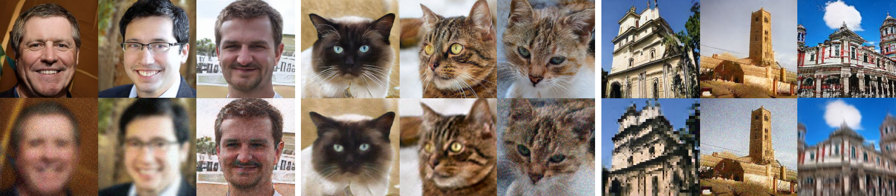

##### Table of contents
1. [Getting Started](#Getting-Started)
2. [Experiments](#Experiments)
3. [Acknowledgments](#Acknowledgments)
4. [Contacts](#Contacts)

# QC-StyleGAN - Quality Controllable Image Generation and Manipulation
<a href="#"></a>
<a href=""></a>

[Dat Viet Thanh Nguyen](https://openreview.net/profile?id=~Dat_Viet_Thanh_Nguyen1),
[Phong Tran The](https://github.com/P0lyFish),
[Tan M. Dinh](https://di-mi-ta.github.io/),
[Cuong Pham](https://sites.google.com/view/cuongpham/home),
[Anh Tuan Tran](https://sites.google.com/site/anhttranusc/)<br>
VinAI Research, Vietnam

> **Abstract:** 
The introduction of high-quality image generation models, particularly the StyleGAN family, provides a powerful tool to synthesize and manipulate images. However, existing models are built upon high-quality (HQ) data as desired outputs, making them unfit for in-the-wild low-quality (LQ) images, which are common inputs for manipulation. In this work, we bridge this gap by proposing a novel GAN structure that allows for generating images with controllable quality. The network can synthesize various image degradation and restore the sharp image via a quality control code. Our proposed QC-StyleGAN can directly edit LQ images without altering their quality by applying GAN inversion and manipulation techniques. It also provides for free an image restoration solution that can handle various degradations, including noise, blur, compression artifacts, and their mixtures. Finally, we demonstrate numerous other applications such as image degradation synthesis, transfer, and interpolation.

|  |
|:--:|
| *Sample images generated by our models on FFHQ (left), AFHQ-Cat (middle), and LSUNChurch (right). For each sample, we provide a pair of sharp (top) and degraded (bottom) images.*|

Details of the model architecture and experimental results can be found in [our following paper](#).
```bibtex
```
**Please CITE** our paper whenever our model implementation is used to help produce published results or incorporated into other software.


## Getting Started

### Requirements

* Linux and Windows are supported, but we recommend Linux for performance and compatibility reasons.
* 1&ndash;8 high-end NVIDIA GPUs with at least 12 GB of memory. We have done all testing and development using NVIDIA DGX-A100 with 8 Tesla A100 GPUs.
* 64-bit Python 3.7 and PyTorch 1.7.1. See [https://pytorch.org/](https://pytorch.org/) for PyTorch install instructions.
* CUDA toolkit 11.0 or later.  Use at least version 11.1 if running on RTX 3090.

The code relies heavily on custom PyTorch extensions that are compiled on the fly using NVCC. On Windows, the compilation requires Microsoft Visual Studio. We recommend installing [Visual Studio Community Edition](https://visualstudio.microsoft.com/vs/) and adding it into `PATH` using `"C:\Program Files (x86)\Microsoft Visual Studio\<VERSION>\Community\VC\Auxiliary\Build\vcvars64.bat"`.

### Installation

- Clone this repo:
``` 
git clone https://github.com/VinAIResearch/QC-StyleGAN.git
cd QC-StyleGAN
```

- Install dependencies:
```
conda create -n qcgan python=3.7.3
conda activate qcgan
pip install -r requirements.txt
```

### Preparing datasets

Datasets are stored as uncompressed ZIP archives containing uncompressed PNG files.

Legacy TFRecords datasets are not supported &mdash; see below for instructions on how to convert them.

**FFHQ**:

- Step 1: Download the [Flickr-Faces-HQ dataset](https://github.com/NVlabs/ffhq-dataset) as TFRecords.

- Step 2: Extract images from TFRecords using `dataset_tool.py` from the [TensorFlow version of StyleGAN2-ADA](https://github.com/NVlabs/stylegan2-ada/):

```.bash
# Using dataset_tool.py from TensorFlow version at
# https://github.com/NVlabs/stylegan2-ada/
python ../stylegan2-ada/dataset_tool.py unpack \
    --tfrecord_dir=~/ffhq-dataset/tfrecords/ffhq --output_dir=/tmp/ffhq-unpacked
```

- Step 3: Create ZIP archive using `dataset_tool.py` from this repository:

```.bash
# Original 1024x1024 resolution.
python dataset_tool.py --source=/tmp/ffhq-unpacked --dest=~/datasets/ffhq.zip

# Scaled down 256x256 resolution.
python dataset_tool.py --source=/tmp/ffhq-unpacked --dest=~/datasets/ffhq256x256.zip \
    --width=256 --height=256
```

**AFHQ**: Download the [AFHQ dataset](https://github.com/clovaai/stargan-v2/blob/master/README.md#animal-faces-hq-dataset-afhq) and create ZIP archive:

```.bash
python dataset_tool.py --source=~/downloads/afhq/train/cat --dest=~/datasets/afhqcat.zip
```

**LSUN**: Download the desired categories from the [LSUN project page](https://www.yf.io/p/lsun/) and convert to ZIP archive:

```.bash
python dataset_tool.py --source=~/downloads/lsun/raw/church_lmdb --dest=~/datasets/lsunchurch.zip \
    --transform=center-crop --width=256 --height=256
```

## Experiments

### Model Zoo

We provide models pre-trained on the FFHQ, AFHQ Cat, and LSUN Church. You can download them manually and reference by filename [LINK](https://drive.google.com/drive/folders/1QZ42G5S_wy1_tIv7ZY-sRZmfCIs86ZbM).

| Path | Description
| :--- | :----------
| QC-StyleGAN | Main directory
| &ensp;&ensp;&boxur;&nbsp; [pretrained](https://drive.google.com/drive/folders/1QZ42G5S_wy1_tIv7ZY-sRZmfCIs86ZbM) | Pre-trained models
| &ensp;&ensp;&ensp;&ensp;&boxvr;&nbsp; ffhq_256x256.pkl | QC-StyleGAN for FFHQ dataset at 256×256
| &ensp;&ensp;&ensp;&ensp;&boxvr;&nbsp; afhqcat_512x512.pkl | QC-StyleGAN for AFHQ Cat dataset at 512×512
| &ensp;&ensp;&ensp;&ensp;&boxvr;&nbsp; lsunchurch_256x256.pkl | QC-StyleGAN for LSUN Church at 256×256
| &ensp;&ensp;&ensp;&ensp;&boxvr;&nbsp; G_teacher_FFHQ_256x256.pth.tar | G Teacher FFHQ at 256x256, transfer learning from FFHQ using StyleGAN2-ADA
| &ensp;&ensp;&ensp;&ensp;&boxvr;&nbsp; G_teacher_AFHQ_Cat_512x512.pth.tar | G Teacher AFHQ Cat at 512x512, pre-trained from StyleGAN2-ADA
| &ensp;&ensp;&ensp;&ensp;&boxvr;&nbsp; G_teacher_LSUN_Church_256x256.pth.tar | G Teacher LSUN Church at 256x256, pre-trained from StyleGAN2
| &ensp;&ensp;&ensp;&ensp;&boxvr;&nbsp; network-pretrained-FFHQ-256x256.pkl | FFHQ at 256x256, transfer learning from FFHQ using StyleGAN2-ADA
| &ensp;&ensp;&ensp;&ensp;&boxvr;&nbsp; network-pretrained-AFHQ-Cat-512x512.pkl | AFHQ Cat at 512x512, transfer learning from AFHQ Cat using StyleGAN2-ADA
| &ensp;&ensp;&ensp;&ensp;&boxvr;&nbsp; network-pretrained-LSUN-Church-256x256.pkl | LSUN Church at 256x256, transfer learning from LSUN Church using StyleGAN2
| &ensp;&ensp;&ensp;&ensp;&boxvr;&nbsp; afhq_psp.pt | pSp model, trained from FFHQ
| &ensp;&ensp;&ensp;&ensp;&boxvr;&nbsp; ffhq_psp.pt | pSp model, trained from AFHQ

### Image Generation

Pre-trained networks are stored as `*.pkl` files on the [QC-StyleGAN Google Drive folder](https://drive.google.com/drive/folders/1QZ42G5S_wy1_tIv7ZY-sRZmfCIs86ZbM) that can be referenced using local filenames:

```.bash
# Generate FFHQ images
python generate.py --outdir=out --trunc=1 --seeds=85,265,297,849 \
    --network=./pretrained/ffhq_256x256.pkl

# Generate AFHQ Cat images
python generate.py --outdir=out --trunc=0.7 --seeds=600-605 \
    --network=./pretrained/afhqcat_512x512.pkl

# Generate LSUN Church images
python generate.py --outdir=out --seeds=0-35 --class=1 \
    --network=./pretrained/lsunchurch_256x256.pkl
```

Outputs from the above commands are placed under `out/*.png`, controlled by `--outdir`. Downloaded network pickles are cached under `$HOME/.cache/dnnlib`, which can be overridden by setting the `DNNLIB_CACHE_DIR` environment variable. The default PyTorch extension build directory is `$HOME/.cache/torch_extensions`, which can be overridden by setting `TORCH_EXTENSIONS_DIR`.

### Training networks

In its most basic form, training new networks boils down to:

```.bash
# FFHQ
python3 train.py --cfg=paper256 --outdir=./training-runs --data=~/datasets/ffhq256.zip \
	 --workers=8 --gpus=8 --batch=64 --q_dim=16 \
	 --resume=./pretrained/network-pretrained-FFHQ-256x256.pkl \
	 --teacher_ckpt=./pretrained/G_teacher_FFHQ_256x256.pth.tar
# AFHQ Cat
python3 train.py --cfg=paper512 --outdir=./training-runs --data=~/datasets/afhqcat.zip \
	--workers=8 --gpus=8 --batch=64 --q_dim=16 \
	--resume=./pretrained/network-pretrained-AFHQ-Cat-512x512.pkl \
	--teacher_ckpt=./pretrained/G_teacher_AFHQ_Cat_512x512.pth.tar
# LSUN Church
python3 train.py --cfg=church256 --outdir=./training-runs --data=~/datasets/lsunchurch.zip \
	--workers=8 --gpus=8 --batch=64 --q_dim=16 \
	--resume=./pretrained/network-pretrained-LSUN-Church-256x256.pkl \
	--teacher_ckpt=./pretrained/G_teacher_LSUN_Church_256x256.pth.tar
```

In this example, the results are saved to a newly created directory `~/training-runs/<ID>-mydataset-auto1`, controlled by `--outdir`. The training exports network pickles (`network-snapshot-<INT>.pkl`) and example images (`fakes<INT>.png`) at regular intervals (controlled by `--snap`). For each pickle, it also evaluates FID (controlled by `--metrics`) and logs the resulting scores in `metric-fid50k_full.jsonl` (as well as TFEvents if TensorBoard is installed).

The name of the output directory reflects the training configuration. For example, `00000-mydataset-auto1` indicates that the *base configuration* was `auto1`, meaning that the hyperparameters were selected automatically for training on one GPU. The base configuration is controlled by `--cfg`:

| Base config           | Description
| :-------------------- | :----------
| `auto`&nbsp;(default) | Automatically select reasonable defaults based on resolution and GPU count. Serves as a good starting point for new datasets but does not necessarily lead to optimal results.
| `paper256`            | Reproduce results for FFHQ at 256x256 using 1, 2, 4, or 8 GPUs.
| `paper512`            | Reproduce results for AFHQ Cat at 512x512 using 1, 2, 4, or 8 GPUs.
| `church256`            | Reproduce results for LSUN Church at 256x256 using 1, 2, 4, or 8 GPUs.

### Quality metrics

By default, `train.py` automatically computes FID for each network pickle exported during training. We recommend inspecting `metric-fid50k_full.jsonl` (or TensorBoard) at regular intervals to monitor the training progress. When desired, the automatic computation can be disabled with `--metrics=none` to speed up the training slightly (3%&ndash;9%).

Additional quality metrics can also be computed after the training:

```.bash
# Pre-trained network pickle: specify dataset explicitly, print result to stdout.
python calc_metrics.py --metrics=fid50k_full --data=~/datasets/ffhq256.zip --mirror=1 \
    --network=./pretrained/ffhq_256x256.pkl
```

### Image restoration
First, run pSp to get the initial latent codes for PTI. To do so, move to the `restoration/pSp` folder and run the following code:
```
cd restoration/pSp
python scripts/inference.py \
	--out_path="INPUT_SAVE_DIR" \
	--checkpoint_path=../..pretrained_models/ffhq_psp.pt \
	--data_path="INPUT_IMAGE_DIR" \
    --stylegan_weights=../../pretrained_models/network-pretrained-FFHQ-256x256.pkl \
	--test_batch_size=4 \
	--test_workers=4 \
```
where `--checkpoint path` and `--stylegan_weights` is the provided pretrained pSp and QC-StyleGAN models, respectively (see the model zoo section).

After running the above script, move the the `restoration/PTI` folder and run the following code:
```
cd restoration/PTI
python inversion.py --network ../../pretrained_models/network-pretrained-FFHQ-256x256.pkl \
		    --image_dir "INPUT_IMAGE_DIR" \
		    --save_dir "INPUT_SAVE_DIR" \
		    --latent_dir "INPUT_LATENT_DIR" \
		    --gen_degraded
```

### Image editing
First, follow the image restoration section to generate inverted latent codes and modified model weights (since we use PTI for image inversion). Then run the following script:
```
cd editing
python edit.py \
    -i "INPUT_LATENT_DIR" \
    -m "INPUT_MODEL_DIR" \
    -b boundaries/smiling_boundary.npy \
    -o "INPUT_SAVE_DIR" \
    -s W \
```
where `-b` is the path of the editing boundary (check interfaceGAN paper for more information), `-i` is the root of the latent codes genenrated in pSp section, `-m` is the root of the modified QC-StyleGAN weights in PTI section.

## Acknowledgments
Our source code is developed based on the codebase of a great series of StyleGAN inversion researches from the Tel Aviv University group, which are: [pSp](https://github.com/danielroich/PTIhttps://github.com/danielroich/PTI), [StyleGAN2-ADA](https://github.com/NVlabs/stylegan2-ada-pytorch) and [PTI](https://github.com/danielroich/PTI). 

For auxiliary pre-trained models, we specifically thank to [MoCov2](https://github.com/facebookresearch/moco), [CurricularFace](https://github.com/HuangYG123/CurricularFace) and [MTCNN](https://github.com/TreB1eN/InsightFace_Pytorch). For editing directions, thanks to the authors of [InterFaceGAN](https://github.com/genforce/interfacegan).

We leverage the PyTorch implementation of [StyleGAN2-ADA](https://github.com/NVlabs/stylegan2-ada-pytorch) for the StyleGAN model. All pre-trained StyleGAN models are from the official release of [StyleGAN2](https://drive.google.com/drive/folders/1yanUI9m4b4PWzR0eurKNq6JR1Bbfbh6L). We convert the original weights exported by TensorFlow code to compatible with the PyTorch version of StyleGAN2-ADA by using [the author's official script](https://github.com/NVlabs/stylegan2-ada-pytorch/blob/main/legacy.py).

Overall, thank you so much to the authors for their great works and efforts to release source code and pre-trained weights.

## Contacts
If you have any questions, please drop an email to _thanhdatnv2712@gmail.com_ or open an issue in this repository.